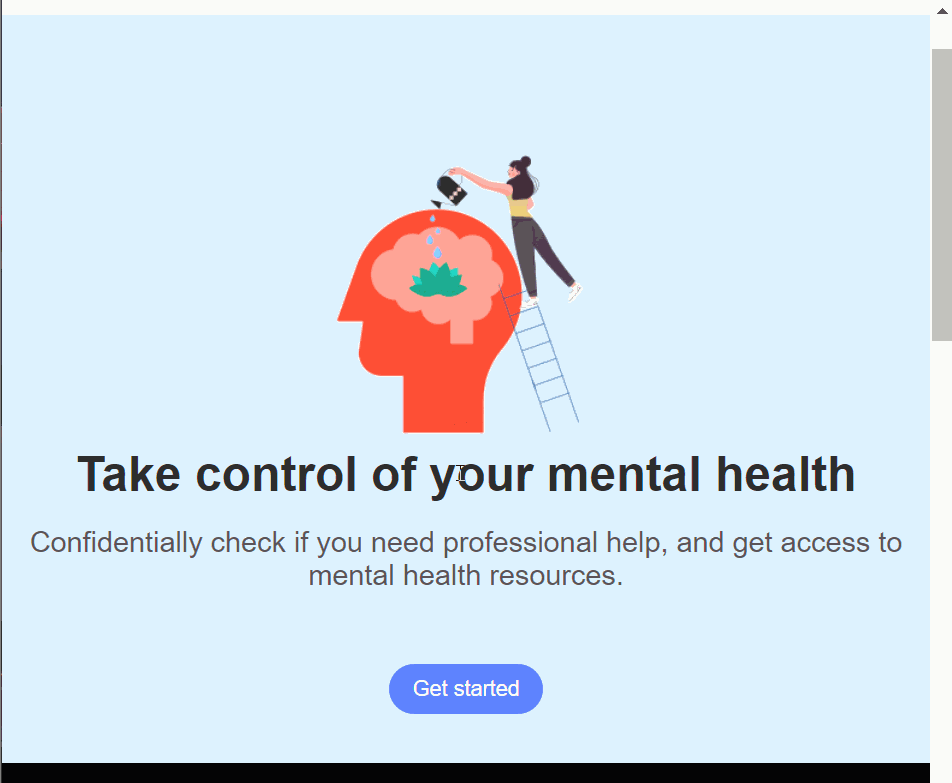
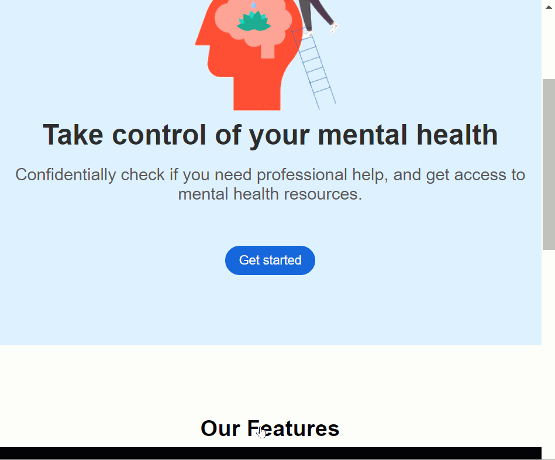

<h1 align="center">Team Innotech's makeathon project for VAIL Spring 2023 </h1>
<h3 align="center">Theme: Physical Health and Mental Well-Being Management</h3>

Welcome to our web app! Our goal is to help individuals determine if they need professional help for mental health issues. We understand the importance of confidentiality, so our web app is designed to provide a safe and secure environment for users to explore their mental health concerns.

### Features:

* Confidentiality: We take privacy seriously and ensure that all user data is secure and confidential.
* User-friendly Interface: Our user interface is designed to be easy to use and understand.
* Prediction Algorithm: Our web app uses a prediction algorithm to analyze user responses and provide an assessment of whether they need professional help.
* Resources: We provide resources and information for users who may need professional help.

### How to Use:

* Users will be prompted to answer a series of questions related to their mental health.
* Based on the responses, our prediction algorithm will analyze the data and provide an assessment of whether the user needs professional help.
* If the user needs professional help, we provide resources and information to help them connect with mental health professionals.

Thank you for using our web app. We hope that it helps you in your journey towards better mental health. If you have any feedback or suggestions for improvements, please feel free to contact us.

### Demo

# Test cases

